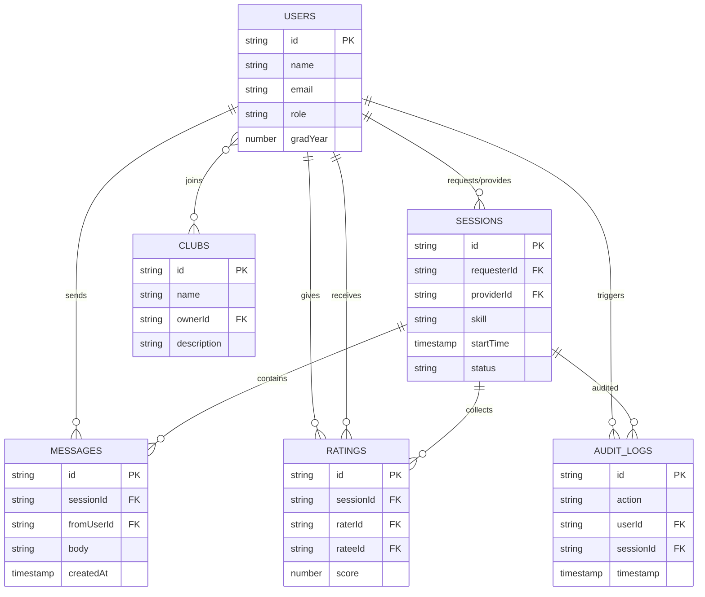
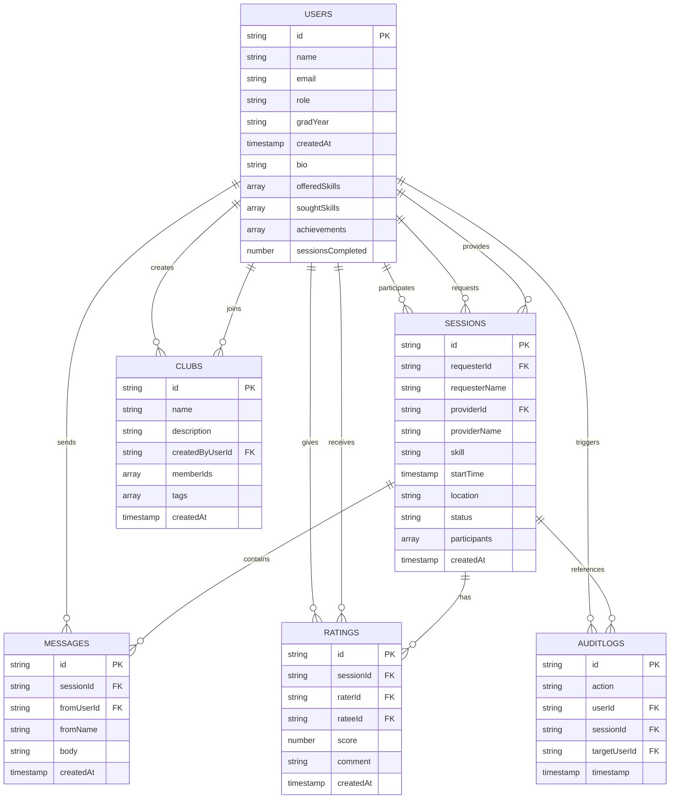

# SkillSwap data model

## ERD (conceptual)

## Collection schemas (Firestore)

### `users`

| Field | Type | Required | Notes |
| --- | --- | --- | --- |
| `name` | string | yes | Display name. |
| `email` | string | yes | Auth email. |
| `role` | string | yes | `student` or `admin`. |
| `gradYear` | number | no | Graduation year. |
| `bio` | string | no | Profile bio. |
| `offeredSkills` | array<object> | no | Objects with `{ name, proficiency }`. |
| `soughtSkills` | array<object> | no | Objects with `{ name, interest }`. |
| `achievements` | array<string> | no | Achievement IDs. |
| `sessionsCompleted` | number | no | Count of completed sessions. |
| `createdAt` | timestamp | yes | Account creation time. |

**Indexes**
- Single-field index on `role` for admin user lists.

### `sessions`

| Field | Type | Required | Notes |
| --- | --- | --- | --- |
| `requesterId` | string | yes | FK to `users`. |
| `requesterName` | string | yes | Denormalized for display. |
| `providerId` | string | yes | FK to `users`. |
| `providerName` | string | yes | Denormalized for display. |
| `skill` | string | yes | Skill being exchanged. |
| `startTime` | timestamp | yes | Scheduled start. |
| `location` | string | no | Meeting location. |
| `status` | string | yes | `pending`, `accepted`, `completed`, `declined`. |
| `participants` | array<string> | yes | `[requesterId, providerId]`. |
| `createdAt` | timestamp | yes | Request creation time. |

**Indexes**
- Single-field array index on `participants` for participant lookups.
- Optional composite index: `participants` (array-contains) + `createdAt` (desc) for sortable dashboards.

### `ratings`

| Field | Type | Required | Notes |
| --- | --- | --- | --- |
| `sessionId` | string | yes | FK to `sessions`. |
| `raterId` | string | yes | FK to `users`. |
| `rateeId` | string | yes | FK to `users`. |
| `score` | number | yes | 1-5 scale. |
| `comment` | string | no | Optional feedback. |
| `createdAt` | timestamp | yes | Rating time. |

**Indexes**
- Composite index on `rateeId` + `createdAt` for profile ratings.
- Composite index on `sessionId` + `createdAt` for session summaries.

### `messages`

| Field | Type | Required | Notes |
| --- | --- | --- | --- |
| `sessionId` | string | yes | FK to `sessions`. |
| `fromUserId` | string | yes | FK to `users`. |
| `fromName` | string | yes | Denormalized for display. |
| `body` | string | yes | Message body. |
| `createdAt` | timestamp | yes | Send time. |

**Indexes**
- Composite index on `sessionId` + `createdAt` (asc) for threaded messages.

### `clubs`

| Field | Type | Required | Notes |
| --- | --- | --- | --- |
| `name` | string | yes | Club name. |
| `description` | string | no | Club overview. |
| `ownerId` | string | yes | FK to `users`. |
| `createdAt` | timestamp | yes | Creation time. |
| `memberIds` | array<string> | no | Optional denormalized members for fast lookups. |

**Indexes**
- Single-field index on `ownerId` for club management.
- Optional array index on `memberIds` for membership lookups.

### `auditLogs`

| Field | Type | Required | Notes |
| --- | --- | --- | --- |
| `action` | string | yes | Action name (e.g., `SESSION_REQUESTED`). |
| `userId` | string | yes | Actor FK to `users`. |
| `targetUserId` | string | no | Optional user affected. |
| `sessionId` | string | no | Optional session FK. |
| `timestamp` | timestamp | yes | Event time. |

**Indexes**
- Single-field index on `timestamp` (desc) for admin audit views.
- Optional composite index on `userId` + `timestamp` for per-user timelines.

## Relationship notes

- A session has exactly two participants (requester/provider), but both are users and appear in `participants` for simplified querying.
- Ratings should be limited to one per rater per session to prevent duplicates.
- Messages are always scoped to a session; the UI should prevent cross-session threads.
- Clubs can model membership with a `memberIds` array or a `clubs/{clubId}/members` subcollection if per-member metadata is needed.
# Data Model (Firestore)

This document captures the conceptual model and schema used by the SkillSwap application for submission requirements.

## ERD / Conceptual Model

> Note: The Firestore SDK provides document IDs as primary keys. Foreign keys are logical references enforced in application logic rather than database-level constraints.

---

## Collection Schemas

### `users`

**Purpose:** Profile and role data for authenticated users.

| Field | Type | Required | Notes / Constraints |
| --- | --- | --- | --- |
| `name` | string | yes | Display name used across UI. |
| `email` | string | yes | Auth email; unique per Firebase Auth user. |
| `role` | string | yes | Enum: `student`, `admin`. |
| `gradYear` | string | yes | Stored as string in UI (e.g., `"2026"`). |
| `createdAt` | timestamp | yes | Set on registration. |
| `bio` | string | no | Optional profile bio. |
| `offeredSkills` | array<object> | no | Each item: `{ name: string, proficiency: "beginner"|"intermediate"|"advanced" }`. |
| `soughtSkills` | array<object> | no | Each item: `{ name: string, interest: "low"|"medium"|"high" }`. |
| `achievements` | array<string> | no | Achievement IDs (`first_session`, `five_sessions`, `ten_sessions`, `five_star`, etc.). |
| `sessionsCompleted` | number | no | Incremented when a session is marked `completed`. |

**Indexes:**
- Default single-field indexes.
- No composite indexes required by current queries.

---

### `sessions`

**Purpose:** Skill swap requests and scheduled sessions.

| Field | Type | Required | Notes / Constraints |
| --- | --- | --- | --- |
| `requesterId` | string | yes | FK to `users` (requesting student). |
| `requesterName` | string | yes | Cached name for UI convenience. |
| `providerId` | string | yes | FK to `users` (providing student). |
| `providerName` | string | yes | Cached name for UI convenience. |
| `skill` | string | yes | Skill topic for the session. |
| `startTime` | timestamp | yes | Scheduled time. |
| `location` | string | no | Optional location text. |
| `status` | string | yes | Enum: `pending`, `accepted`, `completed`, `rejected`. |
| `participants` | array<string> | yes | Contains both user IDs for quick lookup. |
| `createdAt` | timestamp | yes | Created when requested. |

**Indexes:**
- Single-field index on `participants` (array-contains query).
- Optional composite index on `participants` + `status` if filtering by status is added.

---

### `ratings`

**Purpose:** Post-session feedback between participants.

| Field | Type | Required | Notes / Constraints |
| --- | --- | --- | --- |
| `sessionId` | string | yes | FK to `sessions`. One or two ratings per session depending on UX rules. |
| `raterId` | string | yes | FK to `users`. |
| `rateeId` | string | yes | FK to `users`. |
| `score` | number | yes | 1–5 integer. |
| `comment` | string | no | Optional rating text. |
| `createdAt` | timestamp | yes | Time of submission. |

**Indexes:**
- Single-field index on `sessionId` if filtering by session is needed.

---

### `messages`

**Purpose:** Session-specific chat messages.

| Field | Type | Required | Notes / Constraints |
| --- | --- | --- | --- |
| `sessionId` | string | yes | FK to `sessions`. |
| `fromUserId` | string | yes | FK to `users`. |
| `fromName` | string | yes | Cached sender name for UI. |
| `body` | string | yes | Message text. |
| `createdAt` | timestamp | yes | Message timestamp. |

**Indexes:**
- Composite index on `sessionId` (==) + `createdAt` (asc) for ordered session messages.

---

### `clubs`

**Purpose:** Optional student clubs (conceptual model; not yet surfaced in UI).

| Field | Type | Required | Notes / Constraints |
| --- | --- | --- | --- |
| `name` | string | yes | Club display name (unique within organization). |
| `description` | string | no | Club overview and mission. |
| `createdByUserId` | string | yes | FK to `users`. |
| `memberIds` | array<string> | no | User IDs for membership. |
| `tags` | array<string> | no | Skill or topic tags for discovery. |
| `createdAt` | timestamp | yes | Club creation date. |

**Indexes:**
- Single-field index on `memberIds` (array-contains) if filtering by membership is added.
- Optional composite index on `tags` + `createdAt` for discovery views.

---

### `auditLogs`

**Purpose:** Administrative audit trail of system actions.

| Field | Type | Required | Notes / Constraints |
| --- | --- | --- | --- |
| `action` | string | yes | Enum-like string (e.g., `USER_REGISTERED`, `SESSION_REQUESTED`, `USER_DELETED`). |
| `userId` | string | yes | Actor user ID. |
| `sessionId` | string | no | FK to `sessions` when applicable. |
| `targetUserId` | string | no | FK to `users` for admin actions. |
| `timestamp` | timestamp | yes | Log time. |

**Indexes:**
- Single-field index on `timestamp` for admin ordering (desc).

---

## Relationship Summary

- `users` ↔ `sessions`: `sessions.requesterId` and `sessions.providerId` link to `users.id`.
- `sessions` ↔ `messages`: `messages.sessionId` groups chat by session.
- `sessions` ↔ `ratings`: `ratings.sessionId` links feedback to a session.
- `users` ↔ `ratings`: `ratings.raterId` and `ratings.rateeId` link to `users.id`.
- `users` ↔ `auditLogs`: `auditLogs.userId` is the actor; `targetUserId` is the affected user.
- `clubs` ↔ `users`: `clubs.createdByUserId` and `clubs.memberIds` link to `users.id`.
