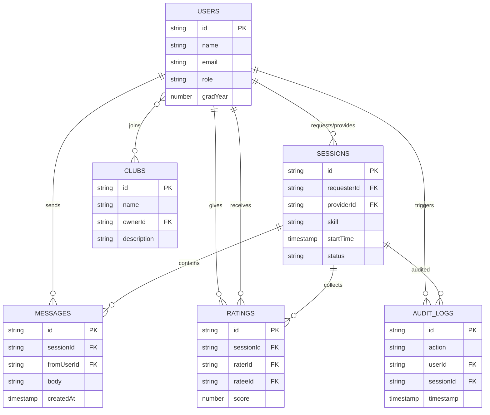

# SkillSwap data model

## ERD (conceptual)

## Collection schemas (Firestore)

### `users`

| Field | Type | Required | Notes |
| --- | --- | --- | --- |
| `name` | string | yes | Display name. |
| `email` | string | yes | Auth email. |
| `role` | string | yes | `student` or `admin`. |
| `gradYear` | number | no | Graduation year. |
| `bio` | string | no | Profile bio. |
| `offeredSkills` | array<object> | no | Objects with `{ name, proficiency }`. |
| `soughtSkills` | array<object> | no | Objects with `{ name, interest }`. |
| `achievements` | array<string> | no | Achievement IDs. |
| `sessionsCompleted` | number | no | Count of completed sessions. |
| `createdAt` | timestamp | yes | Account creation time. |

**Indexes**
- Single-field index on `role` for admin user lists.

### `sessions`

| Field | Type | Required | Notes |
| --- | --- | --- | --- |
| `requesterId` | string | yes | FK to `users`. |
| `requesterName` | string | yes | Denormalized for display. |
| `providerId` | string | yes | FK to `users`. |
| `providerName` | string | yes | Denormalized for display. |
| `skill` | string | yes | Skill being exchanged. |
| `startTime` | timestamp | yes | Scheduled start. |
| `location` | string | no | Meeting location. |
| `status` | string | yes | `pending`, `accepted`, `completed`, `declined`. |
| `participants` | array<string> | yes | `[requesterId, providerId]`. |
| `createdAt` | timestamp | yes | Request creation time. |

**Indexes**
- Single-field array index on `participants` for participant lookups.
- Optional composite index: `participants` (array-contains) + `createdAt` (desc) for sortable dashboards.

### `ratings`

| Field | Type | Required | Notes |
| --- | --- | --- | --- |
| `sessionId` | string | yes | FK to `sessions`. |
| `raterId` | string | yes | FK to `users`. |
| `rateeId` | string | yes | FK to `users`. |
| `score` | number | yes | 1-5 scale. |
| `comment` | string | no | Optional feedback. |
| `createdAt` | timestamp | yes | Rating time. |

**Indexes**
- Composite index on `rateeId` + `createdAt` for profile ratings.
- Composite index on `sessionId` + `createdAt` for session summaries.

### `messages`

| Field | Type | Required | Notes |
| --- | --- | --- | --- |
| `sessionId` | string | yes | FK to `sessions`. |
| `fromUserId` | string | yes | FK to `users`. |
| `fromName` | string | yes | Denormalized for display. |
| `body` | string | yes | Message body. |
| `createdAt` | timestamp | yes | Send time. |

**Indexes**
- Composite index on `sessionId` + `createdAt` (asc) for threaded messages.

### `clubs`

| Field | Type | Required | Notes |
| --- | --- | --- | --- |
| `name` | string | yes | Club name. |
| `description` | string | no | Club overview. |
| `ownerId` | string | yes | FK to `users`. |
| `createdAt` | timestamp | yes | Creation time. |
| `memberIds` | array<string> | no | Optional denormalized members for fast lookups. |

**Indexes**
- Single-field index on `ownerId` for club management.
- Optional array index on `memberIds` for membership lookups.

### `auditLogs`

| Field | Type | Required | Notes |
| --- | --- | --- | --- |
| `action` | string | yes | Action name (e.g., `SESSION_REQUESTED`). |
| `userId` | string | yes | Actor FK to `users`. |
| `targetUserId` | string | no | Optional user affected. |
| `sessionId` | string | no | Optional session FK. |
| `timestamp` | timestamp | yes | Event time. |

**Indexes**
- Single-field index on `timestamp` (desc) for admin audit views.
- Optional composite index on `userId` + `timestamp` for per-user timelines.

## Relationship notes

- A session has exactly two participants (requester/provider), but both are users and appear in `participants` for simplified querying.
- Ratings should be limited to one per rater per session to prevent duplicates.
- Messages are always scoped to a session; the UI should prevent cross-session threads.
- Clubs can model membership with a `memberIds` array or a `clubs/{clubId}/members` subcollection if per-member metadata is needed.
